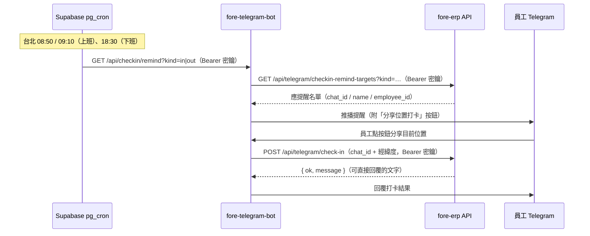

# 線上打卡與 Telegram 整合說明

> 適用範圍：員工儀表板打卡、Telegram bot 打卡與提醒、LINE LIFF 打卡（既有）。
> 測試期定位：線上打卡寫入 `attendance_logs`，僅作為**補卡審核佐證**；月底出勤統計主要依據仍為打卡鐘 CSV（`daily_attendance`），線上打卡**不進**月底統計。

---

## 一、總覽

線上打卡共有三個入口，全部共用同一套伺服器端判定邏輯（`src/lib/attendance-checkin-server.ts` 的 `performCheckin`），只差在身分驗證方式與 `attendance_logs.source` 標記：

| 入口 | source | 身分驗證 | 開放範圍設定 |
|------|--------|----------|--------------|
| 員工儀表板（/employee-portal） | `portal` | Supabase session（Bearer access_token），`employee_id` 由 `user_profiles` 反查 | `app_settings.portal_checkin_scope` |
| Telegram bot（fore-telegram-bot） | `telegram` | Vault 共用密鑰 `leave_notify_secret`；員工由 `telegram_bot_users.chat_id` 對應 | `app_settings.telegram_checkin_scope` |
| LINE LIFF（既有） | `line` | LIFF `getIDToken()` 驗證，`employees.line_user_id` 對應 | —（既有流程） |

## 二、共同打卡規則

所有入口打卡時，伺服器依序檢查（任何一關不過即回覆原因、不寫入）：

1. **時段判定（單一按鈕，不由使用者選上下班）**
   依台北時間自動判定打卡類型：
   - 上班卡：**06:00–10:00**
   - 下班卡：**16:00–20:00**
   - 其他時間：回覆「目前非打卡時段」
   常數定義在 `src/lib/attendance-checkin.ts`（`CHECKIN_IN_WINDOW` / `CHECKIN_OUT_WINDOW`）。
2. **同類型一天限打一次**（以台北時區當日 00:00–23:59 計算，跨入口共用——儀表板打過上班卡，Telegram 就不能再打）。
3. **廠區地理圍欄**
   以工廠中心點（`FACTORY_LAT` 22.97719…, `FACTORY_LNG` 120.27564…）為圓心、**100 公尺**（`GEOFENCE_RADIUS_M`）為半徑，用 Haversine 計算距離；超出範圍回覆「距離工廠約 X 公尺，超過允許範圍」。
4. 通過後寫入 `attendance_logs`（employee_id、check_type `in`/`out`、經緯度、距離、source），回覆「上班／下班打卡成功（距廠區 X 公尺）」。

## 三、開放範圍設定（app_settings）

兩個 key 值域相同：`off`（關閉）／`admin`（僅管理員測試）／`all`（全員開放），預設皆為 `admin`。

| key | 控制對象 | admin 的認定 |
|-----|----------|--------------|
| `portal_checkin_scope` | 儀表板打卡卡片與 `/api/employee/check-in` | `user_profiles.role = 'admin'` |
| `telegram_checkin_scope` | Telegram 打卡**與提醒推播** | `telegram_bot_users.role = 'admin'` |

測試驗證完成後，直接把值改為 `"all"` 即可開放全員：

```sql
update app_settings set value = '"all"'::jsonb where key = 'telegram_checkin_scope';
update app_settings set value = '"all"'::jsonb where key = 'portal_checkin_scope';
```

## 四、員工儀表板打卡

- 前端：`src/components/employee-checkin-card.tsx`（掛在 `/employee-portal`）。未開放（scope 不含自己）或 Mock 模式時整張卡不渲染；卡片每 30 秒重新判定目前時段，顯示單一「上班／下班打卡」按鈕與今日打卡紀錄。
- 定位：瀏覽器 `navigator.geolocation`（高精度、15 秒逾時），權限被拒／逾時有對應中文錯誤訊息。
- API：`src/app/api/employee/check-in/route.ts`
  - `GET`：回目前 scope、是否對自己開放、圍欄半徑、今日紀錄。
  - `POST { latitude, longitude }`：執行打卡。身分一律由 access_token 反查 `user_profiles.employee_id`，**不信任 client 傳來的 employee_id**。

## 五、Telegram 整合

Telegram 端由獨立專案 **fore-telegram-bot**（部署於 `https://fore-telegram-bot.vercel.app`）負責與 Telegram API 互動；ERP 端提供兩支 API 供 bot 呼叫。整體流程：



### 5.1 員工綁定（誰能用 Telegram 打卡）

- `telegram_bot_users`：bot 使用者白名單，`chat_id` 對應 `employee_id`，`is_active = true` 才有效；`role` 為 `admin`／`staff`。
- 綁定方式：後台「員工管理 > Telegram Bot」（`telegram-bot-users-page`）產生一次性邀請碼（`telegram_bot_invites`，預設 7 天有效），員工對 bot 輸入 `/start <code>` 自動註冊綁定。
- 未綁定、停用或沒有對應 `employee_id` 的使用者打卡時，會收到「你的 Telegram 尚未綁定員工帳號，請聯絡管理員設定」。

### 5.2 打卡 API：`POST /api/telegram/check-in`

`src/app/api/telegram/check-in/route.ts`，由 bot 在收到員工分享位置後呼叫：

- 驗證：`Authorization: Bearer <leave_notify_secret>`，經 `public.verify_leave_notify_secret` RPC 核對 Vault 密鑰（與請假／補卡推播共用同一把；該 RPC 僅 `service_role` 可執行）。
- Body：`{ chat_id, latitude, longitude }`。
- 檢查順序：綁定與啟用 → `telegram_checkin_scope`（`admin` 時僅 bot 管理員）→ 共同打卡規則（第二節）。
- 回應的 `message` 為可直接轉發給員工的中文訊息（成功與各種失敗原因都有）。

### 5.3 提醒名單 API：`GET /api/telegram/checkin-remind-targets?kind=in|out`

`src/app/api/telegram/checkin-remind-targets/route.ts`，驗證方式同上。回傳「現在應該被提醒的人」：

- `kind=in`：今天還沒打上班卡的人（08:50 提醒與 09:10 複查共用）。
- `kind=out`：今天**有上班卡但還沒打下班卡**的人（18:30）。

名單條件：在職員工（`employees.employment_status = true`）× `telegram_bot_users` 綁定且啟用；`telegram_checkin_scope = admin` 時僅 bot 管理員。以下情況回**空名單**（bot 拿到空名單就不推播）：

- `telegram_checkin_scope = off`（`skipped: "scope_off"`）
- 當天是國定假日（`public_holidays` 且非補班日，`skipped: "holiday"`）
- 週六日且非補班日（`skipped: "weekend"`）

另外逐人排除：當天有**已核准休假**（`leave_requests`）者、已打過對應卡別者。

### 5.4 提醒排程（pg_cron）

`supabase/migrations/20260909140000_telegram_checkin_remind_cron.sql`，用 `pg_cron` + `pg_net` 定時打 bot 的 `/api/checkin/remind`（假日／週末／已打卡的排除邏輯都在 targets API，所以排程每天照跑）：

| job 名稱 | 台北時間 | cron（UTC） | kind |
|----------|----------|-------------|------|
| `telegram-checkin-remind-in-0850` | 08:50 提醒打上班卡 | `50 0 * * *` | in |
| `telegram-checkin-check-in-0910` | 09:10 複查未打卡者 | `10 1 * * *` | in |
| `telegram-checkin-remind-out-1830` | 18:30 提醒打下班卡 | `30 10 * * *` | out |

pg_cron ≥ 1.4 同名 job 重複 schedule 會直接更新，migration 重跑安全。

## 六、LINE LIFF 打卡（既有）

`POST /api/line/check-in`（`src/app/api/line/check-in/route.ts`）：LIFF 頁面以 `getIDToken()` 取得 ID Token，伺服器向 LINE 驗證後由 `employees.line_user_id` 對應員工；綁定靠人資在後台設定一次性 `line_bind_code`。地理圍欄與 Telegram／儀表板共用同一組常數。

## 七、資料表

### attendance_logs（線上打卡明細）

`supabase/migrations/20260408130000_employees_line_bind_attendance_logs.sql`

| 欄位 | 型別 | 說明 |
|------|------|------|
| id | uuid PK | |
| employee_id | uuid → employees | |
| check_type | text | `in`／`out` |
| latitude / longitude | double precision | 打卡當下座標 |
| distance_meters | numeric(12,2) | 與廠區中心距離 |
| source | text | `portal`／`telegram`／`line` |
| created_at | timestamptz | 打卡時間 |

RLS：admin 全權；一般員工僅能 SELECT 自己的紀錄。Telegram／排程相關寫入皆走 service role。

### 其他相關

- `telegram_bot_users`／`telegram_bot_invites`：bot 白名單與邀請碼（`20260723000000`）。
- `app_settings`：`portal_checkin_scope`、`telegram_checkin_scope`。
- `public_holidays`：假日與補班日判定。
- `verify_leave_notify_secret(p_secret)`：Vault 密鑰驗證 RPC（`20260909130000`），僅 `service_role` 可執行。

## 八、API 一覽

| Method | 路徑 | 呼叫者 | 驗證 |
|--------|------|--------|------|
| GET/POST | `/api/employee/check-in` | 儀表板前端 | Supabase session |
| POST | `/api/telegram/check-in` | fore-telegram-bot | Vault `leave_notify_secret` |
| GET | `/api/telegram/checkin-remind-targets` | fore-telegram-bot | Vault `leave_notify_secret` |
| POST | `/api/line/check-in` | LINE LIFF | LINE ID Token |

## 九、部署／上線檢查清單

1. **Migrations**：確認 `20260909130000_telegram_checkin.sql` 與 `20260909140000_telegram_checkin_remind_cron.sql` 已套用（後者需要專案啟用 `pg_cron`、`pg_net` extension）。
2. **Vault 密鑰**：Supabase Vault 需存在 `leave_notify_secret`，且 fore-telegram-bot 端設定同一把（與請假／補卡推播共用，通常已存在）。
3. **環境變數（fore-erp）**：`NEXT_PUBLIC_SUPABASE_URL`、`SUPABASE_SERVICE_ROLE_KEY`（Telegram 兩支 API 必須用 service role）。
4. **bot 端**：fore-telegram-bot 需實作 `/api/checkin/remind?kind=in|out`（驗證同一把密鑰、查 targets、逐一推播附分享位置按鈕）與分享位置後轉呼叫 `/api/telegram/check-in`。
5. **員工綁定**：後台「員工管理 > Telegram Bot」逐一發邀請碼並確認 `employee_id` 已對應。
6. **開放範圍**：測試期維持 `admin`，由 bot 管理員實測提醒與打卡；驗證後把兩個 scope 改 `all`。
7. **時區確認**：所有時段判定固定 `Asia/Taipei`（無日光節約），cron 以 UTC 表示，調整提醒時間時記得換算。

## 十、程式碼位置速查

| 檔案 | 內容 |
|------|------|
| `src/lib/attendance-checkin.ts` | 共用常數（圍欄、時段、scope key）與時間工具 |
| `src/lib/attendance-checkin-server.ts` | `performCheckin`：時段→重複→圍欄→寫入 |
| `src/components/employee-checkin-card.tsx` | 儀表板打卡卡片 |
| `src/app/api/employee/check-in/route.ts` | 儀表板打卡 API |
| `src/app/api/telegram/check-in/route.ts` | Telegram 打卡 API |
| `src/app/api/telegram/checkin-remind-targets/route.ts` | Telegram 提醒名單 API |
| `src/app/api/line/check-in/route.ts` | LINE LIFF 打卡 API（既有） |
| `supabase/migrations/20260909130000_telegram_checkin.sql` | 密鑰驗證 RPC＋telegram scope 設定 |
| `supabase/migrations/20260909140000_telegram_checkin_remind_cron.sql` | 提醒排程 pg_cron |
